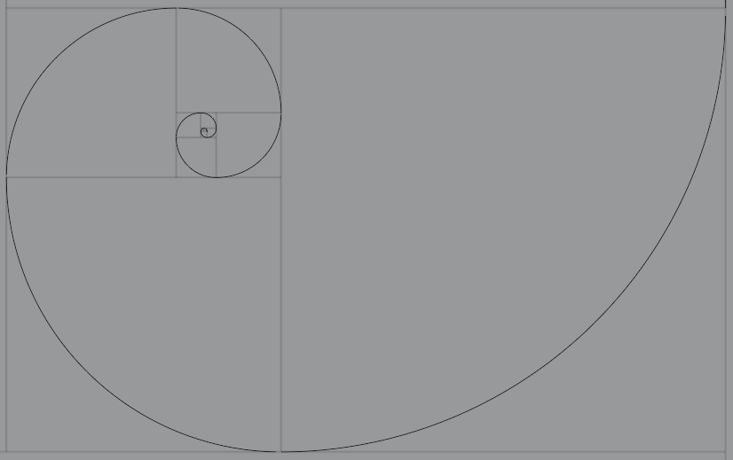
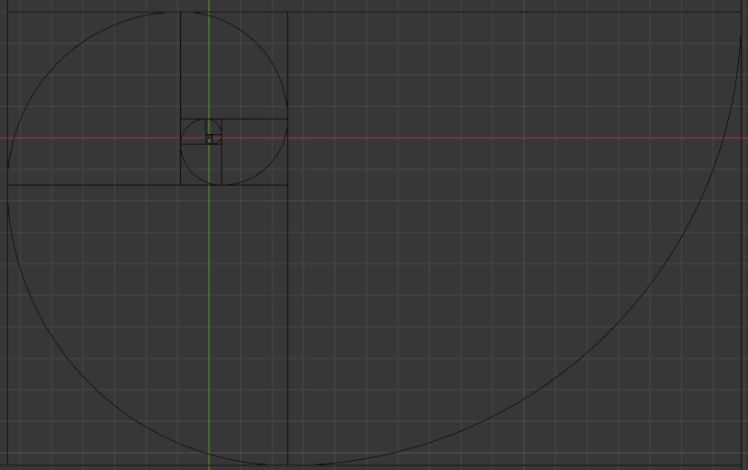
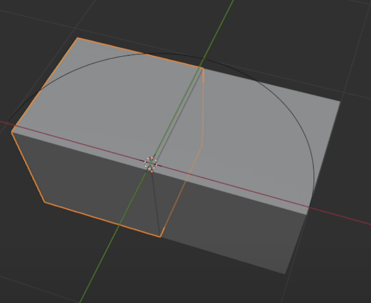
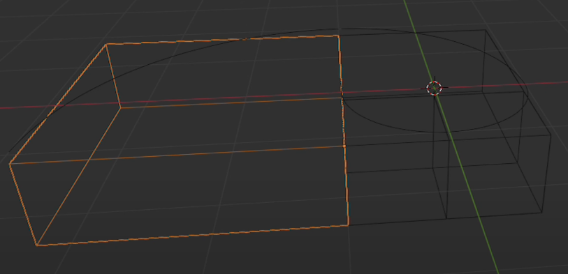
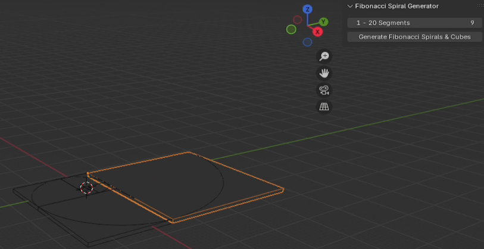

# Fibonacci Spirals & Cubes Generator for Blender

**Create stunning Fibonacci spirals and cube patterns in Blender using the golden ratio.**

## Overview
The **Fibonacci Spirals & Cubes Generator** is a Blender add-on that helps you generate customizable Fibonacci spirals and cube arrangements with precision and ease. Perfect for artists, designers, and creators looking to add mathematical beauty to their 3D projects.

---

## Features
- **Customizable Segments**: Generate spirals with 1 to 20 Fibonacci segments.
- **Dynamic Toggles**: Hide or display spirals and cubes to focus on specific design elements.
- **Golden Ratio Integration**: Create visually appealing patterns based on Fibonacci's sequence.
- **Easy to Use**: User-friendly interface with intuitive controls.

---

## Installation
1. Download the add-on ZIP file from this repository.
2. Open Blender and navigate to:  
   **Edit → Preferences → Add-ons**.
3. Click **Install...**, select the downloaded ZIP file, and install it.
4. Search for **Fibonacci Spirals & Cubes Generator** in the add-ons list and enable it.
5. Save preferences to keep the add-on active.

---

## Usage
1. Open Blender and start a new or existing project.
2. In the **3D Viewport**, go to the right-hand sidebar and locate the **Fibonacci** tab.
3. Set the number of Fibonacci segments (1-20).
4. Click the **Generate Fibonacci Spiral** button to create spirals and cubes.
5. Use the checkboxes to **hide/show** the spirals and cubes dynamically.

---

## Example Workflow
1. Set **Segments** to `10`.
2. Click **Generate Fibonacci Spiral**.
3. Use the **Hide Spiral** checkbox to focus on the cubes only.
4. Export or continue editing for your project needs.

---

## Compatibility
- Compatible with **Blender 3.0 and above**.

---

## Gallery
### Examples of Generated Spirals and Cubes:

---

## Video Demonstration
Watch the Fibonacci Spirals & Cubes Generator in action:  
[Fibonacci Spiral & Cube Generator](https://youtu.be/hSUZn-ZzkLY?si=eoh1gs2hjD60_sWJ)

---

## Support
If you encounter any issues or need assistance:
- Open an issue on this repository.
- Contact me via Blender Market.

---

**Create stunning Fibonacci-based art today!**
